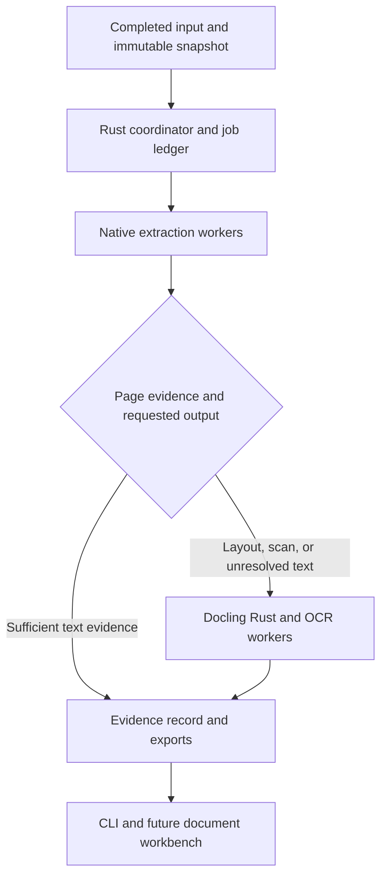

# Text Processing Engine

A native Rust engine for high-throughput, faithful text mining of academic PDFs, primarily on Apple Silicon macOS and also on Linux aarch64. Native Poppler, PDFium, and **Docling Rust (`docling-project/docling.rs`)** are the foundations. MLX is the intended Apple Silicon acceleration route wherever a measured model implementation improves complete-pipeline performance without reducing accuracy.

The eventual application is a compact, accessible, Zed-inspired Rust document workbench: corpus browser, PDF viewer, selectable extracted text, source highlighting, and job controls. The headless engine comes first and remains independently usable.

**Status: early engine, measured accuracy, nothing production-ready.** A pure-Rust extraction engine (`tpe`) and an evaluation harness exist. As of 2026-09-28 (Eval runs 36470860921 dev / 36472085645 holdout, backend `lopdf`, `ubuntu-24.04-arm`, after PR #32), reference recall/precision are 99.5%/99.6% on the 60-paper `dev` split and 100%/100% on the 10-paper `holdout` split; see "What exists today" below for the full table. Body-text alignment (0.751 dev / 0.787 holdout, body only) remains far from the error-free-chunk target below, and no chunk-level exact-match rate has been measured yet: these are reference/metadata/marker diagnostics, not the acceptance measurement. The eval timing (whole-document eval time on hosted arm64 runners, averaged over nominal 20-page chunks, without durable ledger writes) is a diagnostic and is not comparable with the M1 service-time target. The PDFium and docling backends build and pass their unit tests in the Native workflow; the full `docling` pipeline is a routed exception at about 7.7 s/document, and `pdfium` is about 5x slower than `lopdf` on the reference-metrics path. Accuracy reports for these backends come from the Native workflow (first docling comparison on issue #15) but are not summarised here. The workbench crates are libraries with offline tests. The GUI is a skeleton, the Chromium embedding is design-only, and upstream synchronization and MLX acceleration are not implemented. The plan below is unchanged. Implementation notes are in the [Claude Code / Fable handoff](docs/CLAUDE_HANDOFF.md), the per-track status in [Tracks](docs/TRACKS.md), and technical sources and update policy in [Upstreams](docs/UPSTREAMS.md).

## What exists today

The engine is the root crate `tpe` ([Engine](docs/ENGINE.md)):

- `tpe extract` writes page text with span geometry, reading order, metadata, references, citation markers, chunks and figures to one SQLite ledger. Runs are keyed by input hash and backend identity.
- Backends: `lopdf` (pure Rust, the default and only backend in the default build), `pdfium` behind feature `pdfium`, and `docling-text` / `docling` behind feature `docling`. Provisioning of the native libraries and models is in [Native](docs/NATIVE.md).
- Figures: images never enter page text. Each page lists its figures, and `--figures-dir` writes their bytes.
- Scanned-page fixture (`tests/scanned_fixture.rs`): a synthetic image-only page. `lopdf` must find no text, `pdfium` must report one raster figure, and docling OCR must read the text back.
- Evaluation ([Eval](docs/EVAL.md)): `tpe eval` scores the engine against arXiv LaTeX sources. `corpus/manifest.json` pins 70 CC-BY 4.0 arXiv papers by version and SHA-256, 60 in `dev` and 10 in `holdout`.

Measured status, 2026-09-28 (GitHub issue #15, backend `lopdf`, GitHub Actions `ubuntu-24.04-arm`, after PR #32; per-loop taxonomies in [docs/analysis/](docs/analysis/)):

`dev` split (60 papers, tuned on) — Eval run 36470860921:

| metric | value |
| --- | --- |
| reference recall / precision | 99.5% / 99.6% |
| reference-count exact | 91.7% |
| reference title accuracy | 89.3% (60 title-less RSC entries excluded) |
| reference printed-DOI accuracy | 99.6% |
| reference year accuracy | 99.7% |
| paper title accuracy | 91.1% |
| paper authors recall / precision | 98.4% / 96.1% |
| paper DOI accuracy | 100% (5 of 5 stated) |
| citation-marker resolution / marker recall | 99.9% / 93.1% |
| body-text alignment, body only / raw | 0.751 / 0.633 |
| eval time per nominal 20-page chunk, p50 / p95 (hosted arm64, no ledger write; not the M1 target measurement) | 33.8 ms / ~110 ms |

`holdout` split (10 papers, reported only; parser rules are tuned on `dev`, though a failure taxonomy of this split was published once in `docs/analysis/eval-2026-09-28-holdout.md`, so it is not fully blind) — Eval run 36472085645:

| metric | value |
| --- | --- |
| reference recall / precision | 100% / 100% |
| reference-count exact | 100% |
| reference title accuracy | 95.5% |
| reference printed-DOI accuracy | 100% |
| reference year accuracy | not reported |
| paper title accuracy | 100% |
| paper authors recall / precision | 100% / 100% |
| paper DOI accuracy | not reported |
| citation-marker resolution / marker recall | 100% / 97.6% |
| body-text alignment, body only / raw | 0.787 / 0.637 |
| eval time per nominal 20-page chunk, p50 / p95 | 30.3 ms / 83.5 ms |

These are diagnostics from two runs on shared CI hardware. They are not the acceptance measurement described below.

Known gaps: body-text alignment is far from the 99% error-free-chunk goal below, and the loop-7 region tagger over-tags prose on some papers (being fixed in loop 8); marker recall does not yet verify that a marker resolved to the *correct* reference entry, only that it resolved to one; p50 is at or above the 30 ms target on these CI runners, and M1 numbers have not yet been measured; the full `docling` pipeline is a routed exception at about 7.7 s/document; `pdfium` is about 5x slower than `lopdf` on the reference-metrics path. See GitHub issue #15 for the running history and [docs/analysis/](docs/analysis/) for the per-loop taxonomies.

Native workflow: with pinned PDFium and model assets, the `docling` and `pdfium` features build and their unit tests pass on `ubuntu-24.04-arm`. The docling OCR fixture result is not yet known.

Workbench crates under `crates/` (each is a library with offline tests; see [Tracks](docs/TRACKS.md)):

| crate | what it is |
| --- | --- |
| `tpe-common` | shared paper record types |
| `tpe-credentials` | secret storage: macOS keychain, encrypted file, memory |
| `tpe-biblio` | OpenAlex, Crossref, Semantic Scholar, PMC, Europe PMC, Unpaywall, OpenURL clients; dedupe. Google Scholar has no API, so only a search URL builder exists |
| `tpe-zotero` | Zotero Web API client, local database reader, plugin import body ([Zotero](docs/ZOTERO.md)) |
| `tpe-search` | lexical (FTS5) and semantic search over ledger text |
| `tpe-speech` | text-to-speech with a speech-recognition round trip |
| `tpe-app` | GPUI workbench skeleton (macOS only), gated on extraction quality |
| `tpe-browser` | research-browser model (DOI/PDF detection, host policy, cookies). CEF embedding is design-only ([Browser](docs/BROWSER.md)) |

## Performance and fidelity targets

The product goals are **30 ms per 20-page chunk on an M1 Mac**, **at least 99% completely error-free chunks**, and **20 million document extractions per day per M1**. These are simultaneous engineering targets to validate, not achieved capabilities or promises about arbitrary PDFs. The 99% target means exact, checked chunk-level output, not 99% correct characters or words.

| Target | Capacity implication |
| --- | --- |
| 30 ms per 20-page chunk | About 667 pages/second per continuously busy processing lane. |
| 20 million documents per 24 hours | About 231.5 completed documents/second sustained on each M1. |
| If every document is 20 pages | 400 million pages/day, about 4,630 pages/second. |
| 30 ms chunks at that assumed document length | One lane produces at most 2.88 million documents/day; at least seven lanes' worth of effective throughput is needed before overhead. |

A lane is a capacity calculation, not a promise that seven threads or processes scale linearly. Seven ideal lanes yield only 20.16 million 20-page documents/day, leaving less than 1% spare capacity. The benchmarks must demonstrate that throughput and latency hold together under contention on one machine. Account for document-length distribution, partial chunks, shared PDF objects, snapshots, hashing, I/O, rendering, inference, reconstruction, and durable publication. Report document/s and page/s separately; do not count chunks as documents. A document is complete only when all its required chunks and outputs are committed.

The supported workload ranges from **5–10-page PDFs to 15,000-page complex documents**. A 15,000-page document contains 750 nominal 20-page chunks. For an observed corpus, report both mean pages/document and mean `ceil(pages/20)` chunks/document; multiplying either by 231.5 documents/second gives the corresponding required sustained rate. Do not assume all documents contain 20 pages or pad short files into fictitious completed pages. Document complexity and bytes/page are independent workload dimensions.

Before benchmarking, freeze the latency boundary and acceptance percentile in the benchmark specification; neither was specified in the product goal. Measure warm 20-page service time and end-to-end latency including queueing separately, with p50/p95/p99. Service time includes all required parse/render/model/reconstruction work and durable chunk output; separately report and charge document acquisition/open/hash costs to total document time and sustained throughput. Cold starts, model loading, and dependency provisioning remain visible. Do not present parser-only timings as the 30 ms target. The daily target requires a representative 24-hour run; do not establish it by multiplying a microbenchmark.

Freeze the acceptance workload and required output fields before tuning: page-count/byte-size distributions, complexity, digital/scan/mixed proportions, and whether order/tables/coordinates are required. All three targets apply to that same contract. Publish corpus size, hardware model, RAM, storage, OS, thread counts, provider, and precision. Native-text, layout/table, and OCR workloads each need results. No target may be marked achieved by excluding difficult inputs without explicitly narrowing the supported workload. Arithmetic above assumes 20 pages/document only for illustration; actual capacity is measured on the declared workload.

Count newly executed document extractions separately from duplicate discoveries, aliases, cache hits, and resumed/already committed outputs. The 20-million target counts actual extraction work, not cheap rediscovery of previously processed content. Disclose restart work and repeated benchmark inputs; do not let idempotence inflate capacity.

## What survives from earlier attempts

Preserve immutable originals, restartability, bounded memory, idempotent processing, SQLite bookkeeping, and provenance. The first product is PDF text extraction and structure recovery; bibliography matching, web harvesting, citation graphs, and other formats can consume its outputs later.

`makeghrepo` supplies the repeatable repository and CI starting point. This project applies that workflow to a larger engine: track fast-moving upstreams while retaining a working, reproducible application. Avoid another unbounded integration effort by requiring runnable milestones and measured results.

The application and orchestration are Rust. Native C/C++ libraries are legitimate dependencies; rewriting the upstream engines or editor is not the initial task. Python/uv may support reference comparisons and fixtures, but must not become a required production coordinator. Begin with one Rust package and ordinary modules; split crates only at a demonstrated boundary.

## Evidence and accuracy contract

PDFs can contain missing character maps, scanned text, damaged objects, and ambiguous reading order. Preserve these limitations instead of silently emitting plausible text.

- Retain backend text and geometry as evidence. Store normalized text, inferred order, OCR, and model-derived structure as distinct, attributable results.
- Never silently repair spelling, numbers, symbols, negation, citations, or tables with a language model. Generative recovery, if later added, is a separately labelled candidate.
- Keep disagreements and uncertainty. Agreement between engines is not independent proof, especially when they share a parser or model. A heuristic score is not a calibrated correctness probability.
- Test Greek letters, ligatures, superscripts/subscripts, non-BMP characters, units, minus signs, tables, and reading order. A successful exit or attractive Markdown is insufficient.
- Define the reference representation and allowed transformations before benchmarking. Report strict raw text separately; no normalization may conceal a symbol, number, omission, duplicate, or order error.

The acceptance numerator is the number of chunks with **zero errors** against independently checked text/order references and the requested structural fields; the denominator is all eligible test chunks, including failures and timeouts. Report exact-match rate by document class and length, whole-document exact-match rate, character/word errors as diagnostics, and uncertainty on the estimate. A 99% chunk rate does not imply 99% entirely correct 15,000-page documents. Account for correlated errors within documents when estimating uncertainty. Use a held-out corpus and a predeclared statistical acceptance rule; a small observed 99% rate alone does not establish production reliability. No automated golden-file refresh can substitute for independent checking.

## Architecture



| Component | Planned role | Constraint |
| --- | --- | --- |
| Poppler | Native text/layout candidate and independent comparator. Benchmark `pdftotext` with coordinates; add a narrow C++ adapter if startup or missing metadata is material. | Layout is not universal ground truth; review GPL obligations before linking or bundling. |
| PDFium | Text/glyph geometry, rendering, and a second extraction candidate through a pinned Rust binding. | `pdfium-render` serializes native calls within a process; concurrent documents need bounded worker processes. |
| Docling Rust | Primary structured-document adapter for layout, reading order, OCR, tables, and difficult PDFs; included in the initial comparison. | Its current default text parser is Rust/lopdf; PDFium remains a renderer and text fallback. Test models, runtimes, and PDF conformance. |
| MLX | Optional macOS model backend for demonstrated expensive layout/OCR/table stages. | Requires a concrete model implementation and parity tests; not an automatic replacement for ONNX Runtime or acceleration of PDF parsing. |

These are roles, not a predetermined speed ranking. Compare all three extraction modes on identical inputs before selecting a default, with separate equal-output tracks for raw text, required structure/tables, and OCR. A backend that cannot produce the requested structure is unsupported on that track, not a faster equivalent. Keep an explicit full-Docling mode: a cheap text pass cannot establish that tables or columns were understood. Sample apparently successful native output for deeper comparison to measure missed failures.

Route by page/region where supported by the pinned adapter. Keep the complete immutable PDF available because pages share fonts and objects; a 20-page scheduling chunk is not permission to split bytes or discard document context. If an adapter only processes whole documents, report that cost rather than claiming selective execution. Do not run all engines or rasterize all pages in the production fast path without evidence that this meets the goals.

Retain a document session in its owning worker so chunking does not reopen and reconstruct a 15,000-page document 750 times. Stream page/chunk outputs, bound decoded-page/raster caches, and checkpoint committed chunks. Measure unavoidable whole-document parser/index memory; do not claim constant memory merely because output is streamed. Use fair queues and admission limits so huge files neither starve short PDFs nor consume all workers. Yield between chunks where the backend allows it; retain bounded resident sessions or reload explicitly with measured cost. Preserve cross-chunk reading order, continued tables, and page identity; bounded context overlap must not duplicate exported content. On recovery, rebuild necessary parser state and reuse committed chunk outputs rather than silently declaring an incomplete document finished.

### Safe input, concurrency, and recovery

1. Accept completed bytes and obtain a coherent read-only snapshot before hashing/parsing. An open file descriptor, `mmap`, or metadata check alone does not make a changing file immutable. Use clone/reflink optimizations where valid, with a portable copy fallback and a defined acquisition protocol for actively written files.
2. Track path/inode aliases as observations; content hash is the durable document identity. Defer cloud placeholders and incomplete downloads explicitly. Never modify originals.
3. Use bounded, long-lived worker processes. Keep native handles inside their owner. Load model sessions once where supported; coordinate process count with each library's own thread pool. Do not multiply Docling/ONNX concurrency blindly.
4. Bound queue bytes, pixels, RAM, temporary disk, and execution time. Apply backpressure. Record crashes/timeouts, retry finitely, then quarantine visibly. Process isolation is a crash boundary, not a complete security sandbox.
5. Handle password-protected PDFs using supplied credentials through backend APIs. Distinguish missing/wrong password, unsupported encryption, corruption, and extraction failure. Keep passwords out of argv, logs, and durable manifests.

Start with versioned local IPC, not a service. A job carries snapshot/hash, page selection, requested output, limits, configuration digest, and a transient credential channel. A result carries status, output references, warnings, stage timings, and execution identity.

### Durable records

Use a project-owned versioned schema that retains native evidence and original DoclingDocument JSON; avoid coupling the public contract to one upstream's changing types. Record source hash; page/span/glyph references where available; text, boxes, page dimensions, rotation and coordinate frame; backend/model/runtime hashes and settings; normalization mappings; reading-order edges; table structure; warnings; and complete/partial/failed/deferred status. Declare unavailable geometry rather than inventing it. Test crop/rotation transforms used by the eventual viewer.

TXT/Markdown are exports; structured evidence is authoritative. SQLite holds a small job ledger and manifests with a single writer and batched transactions. Keep large artifacts outside it initially. Key jobs by input hash **and processing identity** so upgrades produce new attributable output. Atomically publish outputs before marking completion; reconcile orphan outputs after interruption. Execution may repeat, but publication is idempotent. Avoid retaining every raster or logging per glyph; retain failure evidence and reproducible render settings.

## Native builds, MLX, and upstream updates

| Target | Validation |
| --- | --- |
| `aarch64-apple-darwin` | Primary native build; physical M1 performance tests, minimum macOS and library-loading checks, actual model/device probes. |
| `aarch64-unknown-linux-gnu` | Native ARM64 build/runtime checks and CPU baseline; record glibc/library requirements and target-machine resources. |

GitHub currently provides M1 ARM64 macOS and native Linux ARM64 runner labels. Use explicit OS labels and record image versions. Probe Metal availability; an M1-labelled hosted VM is not proof of physical M1 GPU performance. Hosted CI uses public/synthetic fixtures; bulk corpus processing stays on explicitly selected runtime machines.

Profile acquisition/hash, parse, render, preprocessing, inference, reconstruction, and writes separately. Investigate one MLX model early alongside a CPU reference. Measure conversion feasibility, numerical parity, cold start, sustained batches, and shared-memory pressure. Docling Rust offers CoreML through ONNX, with documented correctness/startup caveats; CoreML and MLX are separate paths. Linux ARM64 retains a CPU baseline even though MLX upstream now supports some Linux configurations.

Track upstream changes in a candidate lane while releases use a pinned accepted set. Planned scheduled workflows discover revisions, build changed candidates, compare the corpus, and open update PRs. Pin native sources, bindings/API features, build recipes, weights, precision, and artifact hashes together. Cache by the complete build identity; app PRs reuse accepted native artifacts. No moving dependencies or model downloads during ordinary processing. See [Upstreams](docs/UPSTREAMS.md).

## Delivery gates

| Stage | Deliverable and completion condition |
| --- | --- |
| 0. Comparison | Licensed fixtures/reference protocol; real Poppler, PDFium, Docling Rust runs on both native targets; accuracy/stage-cost report; scoped M1 acceleration experiment. Expose feasibility gaps against both performance goals. |
| 1. Useful CLI | Batch extraction, evidence JSON/TXT, bounded workers, passwords, and per-file outcomes. Demonstrate resume, aliases/duplicates, malformed inputs, and unchanged originals. |
| 2. Structured recovery | Docling layout/OCR/tables and measured routing. Demonstrate coverage and error-free-chunk rate on holdout inputs; report extra cost and unresolved cases. |
| 3. Sustained engine | Native artifacts, candidate update PRs, reproducible rebuilds, rollback/install tests, and graduated soak tests leading to a 24-hour target test on each M1 configuration claimed. |
| 4. Workbench | Separate Rust GUI over proven engine output, with PDF/text correspondence, search, job control, and accessible interaction. GUI failure cannot invalidate extraction. |

Report completed documents/s, pages/s, bytes/s, latency percentiles, peak RSS, CPU/GPU settings, disk writes, retries, and accuracy by stratum. Do not trade correctness for a faster headline. A missed target calls for a measured bottleneck report and a focused next experiment, not a redefinition of success.

## Zed-inspired workbench

Evaluate **GPUI** for a small standalone Rust application. Reuse Zed's responsiveness and panes as interaction references, building only corpus browsing, PDF/text viewing, source highlighting, disagreement inspection, search, and pause/resume. Keep language servers, terminals, collaboration, and editor-agent features out of scope.

GPUI is Apache-2.0 and pre-1.0; Zed application code has different licensing. Pin the GUI dependency separately. Its current accessibility integration does not establish our app's usability: prove VoiceOver, large adjustable text, contrast, keyboard access, selectable text, and reduced motion in a small prototype before expanding it. Keep processing state in the engine, not in UI-only storage.

## Development and checks

Follow [AGENTS.md](AGENTS.md). Existing scaffold checks remain:

```sh
uv run ruff format && uv run ruff check && uv run pytest && uv audit --preview-features audit-command
cargo fmt && cargo clippy --all-targets -- -D warnings && cargo test
swift build && swift test
cmake -S . -B build && cmake --build build && ctest --test-dir build
```

`main` is protected: open a PR; the `ci` check must pass before merging (squash only). Never force-push `main`.

Inherited merge-release automation currently publishes Python artifacts; it is not the intended ARM Rust distribution pipeline. Align packaging, tag-derived versions, and native CI in a focused implementation PR before declaring the engine releasable. The scaffold's MIT license does not replace native-library or model licenses.
