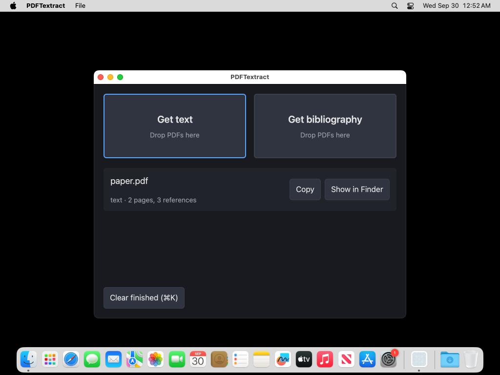

# PDFTextract: the macOS app

Status: **first cut, built and unit-tested in CI, not yet exercised by hand
on a Mac.** `crates/tpe-app` is a GPUI window over the engine, in one
process. It does two things to a PDF: get its text, or get its bibliography.
Output lands next to the PDF; the window shows one row per job with a
per-page progress bar.

## What it does

| action | engine call | files written next to `paper.pdf` |
| --- | --- | --- |
| Get text | `pipeline::run_job_observed` (what `tpe extract` runs), then the ledger write `tpe extract` does | `paper.txt` (ordered page text, pages separated by form feed, as `tpe extract --out` writes it) |
| Get bibliography | `bibliography::scan_backward_observed` (what `tpe bibliography` runs) | `paper.references.json` (the CLI's record, `bibliography::Record`, [BIBLIOGRAPHY](BIBLIOGRAPHY.md)) and `paper.references.txt` (one entry per line, label then `raw`) |

An existing file is never overwritten: the next run writes `paper 2.txt`
(`jobs::output_path`, test `output_names_avoid_existing_files`); the two
bibliography files share one number, so a pair never mixes two runs
(`jobs::output_paths`). A failed
job, an engine panic included, writes nothing next to the source (test
`malformed_input_fails_and_writes_nothing`). A bibliography the engine
reports `not_found` is shown as such and writes nothing. The ledger `tpe
extract` requires lives at
`~/Library/Application Support/PDFTextract/ledger.sqlite`; bibliography jobs
need none.

Ways in:

- the two buttons (press, or Enter/Space when focused, to choose files; each
  is also a drop target for PDFs);
- File menu: Get Text… (⌘O), Get Bibliography… (⌘B), Clear Finished (⌘K);
- Finder: right-click a PDF → **Get Text with PDFTextract** / **Get
  Bibliography with PDFTextract** (`NSServices` in `bundle/Info.plist`,
  answered by the Objective-C provider `src/services.rs` declares at run
  time; test `provider_answers_both_service_messages`, macOS only);
- the job list from the keyboard: Tab reaches it (one stop, after the two
  big buttons); Up and Down move a selection, Home/End or ⌘↑/⌘↓ jump to the
  first or last row, Enter or Space shows the selected row's result in
  Finder, ⌘C copies its text, Delete removes it if it is still queued or
  stops it if it is running, Escape stops a running one (a finished, failed
  or cancelled row is never removed by a stray key; Clear finished, ⌘K, does
  that). The buttons on each row do the same for the pointer;
- Finder: Open With PDFTextract, or drop PDFs on the Dock icon
  (`CFBundleDocumentTypes`, delivered through `Application::on_open_urls`;
  these run *Get text*, since Open With cannot say which action);
- `tpe-app paper.pdf …` from a shell queues the files for text.

Jobs run one at a time (the ledger has one writer). A queued row can be
removed; a running one is stopped with Cancel (or Escape, or Delete): the
row shows "Cancelling" at once and the engine stops at its next page, after
which nothing has been written for it, not even to the ledger, and the queue
moves on. The row stays as "Cancelled" until cleared. What cannot be
interrupted: one page's extraction, and the ordering, cleanup and citation
passes after the last page; a stop requested during those is honoured just
before anything is written. Finished rows offer Copy (the text output to the
clipboard) and Show in Finder. Closing the window while rows are queued or
running does not stop them: the view lives on, the app quits itself once
idle, and the Dock icon reopens the window on the same rows. Files opened
with the app before the window exists (a cold launch from Finder) are kept
and queued once it does (`jobs::Mailbox`, test
`mailbox_keeps_items_until_a_sender_is_installed`).

## Fast by construction

- The engine runs in this process on GPUI's background executor: no
  subprocess, no serialisation, no parsing of its output. Its regexes are
  compiled at launch, off the main thread, so the first job does not pay.
- Everything the user does is answered on the main thread before the engine
  is asked: a dropped PDF is a row before its first page is read.
- Progress is one `Progress` event per page over an unbounded channel; the
  foreground task keeps only the newest event waiting at each frame, so a
  15,000-page document does not queue 15,000 re-renders.
- Outputs are written by the background task after the engine finishes;
  a failed or cancelled job writes nothing. Each file is written completely
  to a hidden temporary name beside the PDF and given its final name with a
  hard link, which fails rather than replace an existing file: a force-quit
  leaves no short file, and two writers can never take the same name
  (`jobs::publish`, tested with eight at once). On a file system without
  hard links (FAT, some network shares) it creates the final name
  exclusively and writes in place instead, where a force-quit mid-write can
  leave a short file. The ledger write is the engine's own
  (`Ledger::write_result`).

### Measured: cost of drawing the job list

GPUI's test platform, `--release`, x86-64 Linux, one full draw (layout,
prepaint, paint) of the window with N queued rows and nothing running, when
every row was built on every redraw:

| rows | draw time |
| ---: | ---: |
| 1 | 0.5 ms |
| 100 | 8.5 ms |
| 1,000 | 94 ms |
| 5,000 | 553 ms |

About 85 µs per row, linear, and a running job redraws once per frame, so a
drop of a few hundred PDFs would have stuttered. The list is now a GPUI
`uniform_list`: rows are all `ROW_HEIGHT_REMS` tall (so the height follows
the text size), and only the rows on screen are built. The same 5,000-row
draw is guarded by a test (`drawing_cost_does_not_grow_with_the_number_of_rows`,
debug build, 400 ms bound against roughly 3 s before). These are not M1
numbers and not click-to-pixel latency; launch time, click-to-row latency and
per-page progress cost on an M1 have not been recorded.

### Measured: interactions on Apple silicon (CI)

`interaction_timings` (an ignored test the App workflow runs with
`--release`) on a GitHub `macos-15-arm64` runner, medians. This is GPUI's
test platform: view state, layout and scene building on the CPU, no GPU and
no display, so it is the app's own cost per interaction and not
click-to-pixel latency.

| interaction | median |
| --- | ---: |
| first frame, empty window | 0.20 ms |
| frame, empty window | 0.12 ms |
| file arrives to its row drawn | 0.45 ms |
| frame, 100 rows | 0.57 ms |
| frame, 5,000 rows | 0.52 ms |
| Down key to selection drawn, 5,000 rows | 0.61 ms |
| End / Home to the new rows drawn (two frames), 5,000 rows | 0.91 ms |
| progress event to its frame, 5,000 rows | 0.62 ms |
| Get text job, 2-page paper (engine, ledger, file) | 30.6 ms |
| Get bibliography job, 2-page paper (engine, files) | 58.9 ms |

Every interaction is under 1 ms against a 16.7 ms frame at 60 Hz, and frame
cost does not grow with the row count (100 rows and 5,000 cost the same).
The two jobs are engine work on a tiny synthetic paper, not a real article.
The runner's chip is a virtualised Apple-silicon part, so an M1 at home will
differ. Not measured: launch time, GPU present, real PDFs.

## Layout

- `src/jobs.rs` (library, every platform, tested): `Action`, the `JobList`
  (rows, one job at a time, progress, finish, remove, clear), where output
  files go, `file_url_to_path` for `on_open_urls`, and `run`, the in-process
  engine call behind each button.
- `src/gui.rs` (binary, macOS): the window. Two buttons that are drop
  targets, the job list with bars, keys, menus, the Finder hooks. The
  platform calls it makes (file chooser, Finder, quit) go through one small
  `Host` so the tests can answer them.
- `src/gui/tests.rs` (macOS): headless tests of the window under GPUI's test
  platform; see below.
- `src/services.rs` (binary, macOS): the `NSServices` provider.
- `bundle/Info.plist`, `bundle.sh`: assemble `target/release/PDFTextract.app`
  with the release binary, ad-hoc signed. The tag-derived version goes into
  both the plist and the binary (`PDFTextract --version`), never into a
  manifest field (AGENTS.md).
- `tests/fixtures/synthetic-paper.pdf`: the engine's synthetic paper
  (`tests/common/mod.rs::synthetic_paper`), used by the `jobs` tests.
- `.github/workflows/app.yml`: `macos-15`; fmt, clippy and the crate's tests
  with GPUI compiled in, then `bundle.sh` and a bundle smoke test, and the
  zipped app as an artifact. It runs only when the crate or the dependency
  set (`Cargo.toml`, `Cargo.lock`) changes and is not part of the required
  `ci` check, so engine PRs never queue macOS runners; `jobs.rs`, the part
  of the crate that uses the engine, is compiled and tested on every Linux
  `ci` leg.
  GPUI stays a macOS-only dependency: it type-checks on Linux but needs
  `libxkbcommon-x11` to link there.

The workbench library modules (`ledger`, `view`, `tpe_ai`, `keys`) are
untouched; the three-pane workbench window they served was replaced by this
one (it is in the history of `src/gui.rs`).

## Build and run

```sh
sh crates/tpe-app/bundle.sh --open     # needs Rust and Xcode's command-line tools, macOS 14+
cargo run -p tpe-app -- paper.pdf     # the window without a bundle (no Finder integration)
```

The bundle is ad-hoc signed and not notarized: on first launch macOS asks for
confirmation (right-click → Open). There is no app icon yet.

## Headless window tests

`src/gui/tests.rs` drives the real view, key bindings and engine (on the
synthetic paper) under GPUI's test platform, with only the file chooser,
Finder and `quit` replaced. They check, with keystrokes: focus starts on
Get text; Enter, Space, Tab and Shift-Tab reach both actions; ⌘O, ⌘B and ⌘K
work from anywhere; a cancelled chooser adds nothing; chosen files become a
row at once and finish; files sent before the window exists (a cold launch
from Finder) and while it is open are queued in order; Tab reaches the list
and Clear finished; arrow keys, Home and End move a selection that keeps
itself in view; Enter shows the selected row in Finder, ⌘C copies its text
(to the clipboard), Delete removes only queued rows; keys reach rows that are
not on screen; clicking a row selects it and focuses the list; rows are all
the same height and their text fits; Escape and Delete stop the running job
(row shown as "Cancelling" at once, then "Cancelled", nothing written, the
queue moves on), and neither touches a queued or finished row; a cancelled
row can be shown in Finder and cleared; closing the window keeps a running
job and the app quits itself once idle; the Dock icon reopens the window on the same rows;
a bad file fails its row and the queue moves on; ⌘= ⌘- ⌘0 change the text
size, at 200% the controls have grown and rows still hold their text, and
the size survives a relaunch (a damaged settings file opens at normal).

They run in the macOS App workflow. They were also run on Linux, with GPUI
built as an ordinary dependency and `libxkbcommon-x11-dev` and friends
installed, through a local patch that is not part of the repository (GPUI
stays macOS-only in `Cargo.toml` so the Linux `ci` legs need none of that).
A simulated click steps the executor between mouse-down and mouse-up, which
would finish a job before its Cancel button is released, so the Cancel button
is checked for presence and its handler (`Shell::cancel`) is called directly;
the keys are dispatched without stepping the executor. GPUI has no public
way to build a file-drop event, so drops are covered
through `Shell::enqueue`, which the drop listener calls, and not by an actual
drop.

## Accessibility: verified vs reasoned

Nothing below has been run by a person on a Mac yet. Verified by CI: the
crate builds with GPUI and passes clippy and its tests, including the
headless keyboard tests above; the bundle declares its document type and
Services and signs; the Services provider answers both messages; and the
built bundle, opened with a PDF through Launch Services (the Open With and
Dock-drop path), starts, shows one window (640×508 points with its title
bar), processes the file and writes `paper.txt`, then quits when asked. The
App workflow keeps that window list and a screenshot as an artifact; the
first one:



Not covered by that run: the Finder Services menu, a real drop or click, and
anything by voice or switch. Reasoned from the code:

- **Screen readers and switch access: not supported by the framework.**
  GPUI 0.2.2 exposes no accessibility tree (see the accessibility note in
  the previous `src/gui.rs`), so VoiceOver, Voice Control and Switch Control
  cannot see these controls. This is the app's largest known gap and needs
  an upstream accessibility layer.
- Keyboard (verified headlessly, see above): every action is on a key (⌘O,
  ⌘B, ⌘K, ⌘Q; Tab/Shift-Tab through the two big buttons, the job list and
  Clear finished; Enter or Space on the focused one; arrows, Home, End, ⌘C,
  Enter and Delete inside the list). Rows are reachable whether or not they
  are on screen. The accent border on the focused control and the selection
  highlight are drawn, not tested. Nothing is timed, nothing expires.
- Targets: the two buttons are full-width and at least 132 pt tall; row
  buttons are padded. Drop is an alternative to the button, never the only
  path.
- Text: ⌘= / ⌘+ larger, ⌘- smaller, ⌘0 back to normal (View menu too), in
  steps of 12.5% from 75% to 200%. Everything is sized in rems, so buttons
  and rows grow with it (rows are 6.5 rem: at 200% a two-line status still
  fits, which a 6 rem row did not). The size is remembered in `text-scale`
  beside the ledger; a missing or damaged file opens at normal size. At
  200% the default 640×480 window shows only a few rows; resize it.

## Known limits

- One job at a time; a 15,000-page document holds the queue until it is
  finished or cancelled (Cancel takes effect at the next page).
- Progress for a bibliography counts pages read from the end against the
  whole page count, so its bar usually finishes early. That is the true
  state of the backward scan, not an estimate.
- No preferences: the `lopdf` backend, no password support (the engine takes
  one; the window does not ask).
- No icon, no notarization, no installer: `bundle.sh` produces the bundle
  and the App workflow attaches it to each run.
